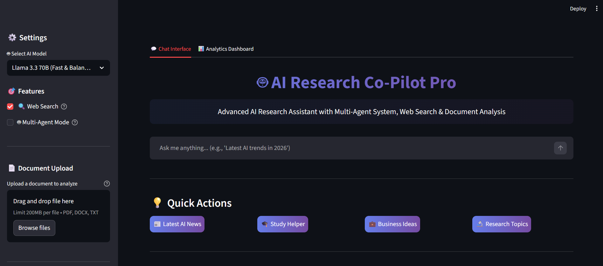
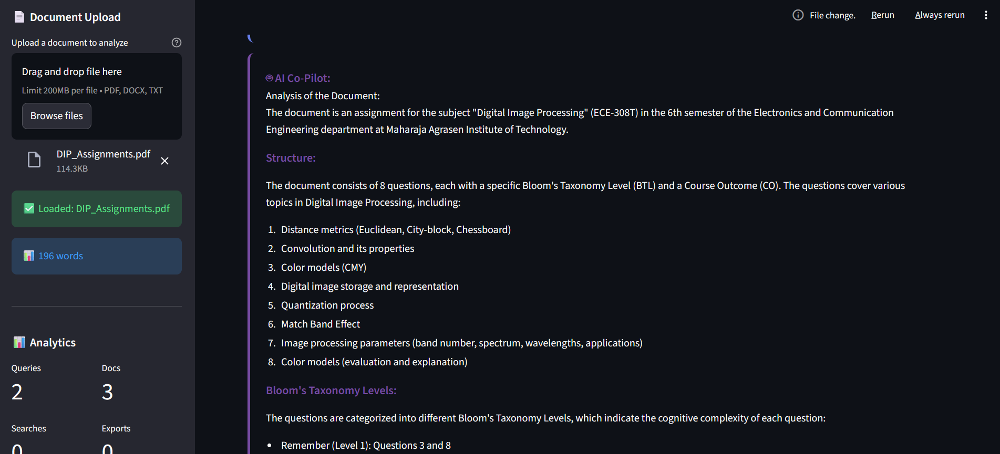

# AI Research Co-Pilot Pro

A production-ready AI research assistant built with a custom multi-agent architecture. Upload documents, search the web in real-time, and generate comprehensive research reports instantly.


## 📸 Screenshots


*AI Research Co-Pilot in action with multi-agent system*


*Real-time analytics and usage statistics*

## Features

### Custom Multi-Agent System
Built from scratch without frameworks - three specialized AI agents working together:
- **Researcher Agent**: Gathers and organizes information from web searches
- **Analyst Agent**: Synthesizes data and identifies key insights
- **Writer Agent**: Creates polished, professional outputs

### Real-Time Web Search
- DuckDuckGo API integration
- Automatic source citation
- Current information beyond AI training data

### Document Intelligence
- Upload and analyze PDF, DOCX, and TXT files
- Extract insights from documents
- Ask questions about uploaded content

### Professional Reports
- Export research as PDF or Word documents
- Formatted with sources and citations
- Complete multi-agent breakdown included

### Analytics Dashboard
- Track usage statistics
- Interactive visualizations with Plotly
- Query history and insights

## Quick Start

### Prerequisites
- Python 3.8 or higher
- Nebius AI API key ([Get one here](https://studio.nebius.ai/))

### Installation

1. Clone the repository
```bash
git clone https://github.com/Shashank-133/ai-research-copilot.git
cd ai-research-copilot
```

2. Create virtual environment
```bash
python -m venv venv
source venv/bin/activate  # On Windows: venv\Scripts\activate
```

3. Install dependencies
```bash
pip install -r requirements.txt
```

4. Set up environment variables
```bash
cp .env.example .env
# Edit .env and add your Nebius API key
```

5. Run the application
```bash
streamlit run main.py
```

The app will open in your browser at `http://localhost:8501`

## Tech Stack

- **Frontend**: Streamlit
- **AI Models**: Nebius AI (Llama 3.3 70B, DeepSeek V3, Qwen3 235B)
- **Architecture**: Custom multi-agent system with RAG
- **Web Search**: DuckDuckGo API
- **Document Processing**: PyPDF2, python-docx
- **Report Generation**: ReportLab
- **Visualization**: Plotly, Pandas

## Project Structure
```
ai-research-copilot/
├── src/
│   ├── __init__.py
│   ├── config.py          # Configuration and settings
│   ├── search.py          # Web search functionality
│   ├── document.py        # Document processing
│   ├── export.py          # PDF/DOCX export
│   └── agents.py          # Multi-agent system
├── main.py                # Streamlit application
├── requirements.txt       # Python dependencies
├── .env.example          # Environment template
└── README.md             # This file
```

## Architecture
```
┌─────────────────────────────────────────┐
│      Streamlit Web Interface            │
├─────────────────────────────────────────┤
│  ┌──────────┐  ┌──────────┐  ┌───────┐  │
│  │Researcher│→ │ Analyst  │→ │Writer │  │
│  │  Agent   │  │  Agent   │  │ Agent │  │
│  └──────────┘  └──────────┘  └───────┘  │
├─────────────────────────────────────────┤
│ Web Search │ Document │ Export          │
├─────────────────────────────────────────┤
│         Nebius AI API Layer             │
└─────────────────────────────────────────┘
```

## Key Technical Decisions

### Why Custom Multi-Agent vs Framework?
- **Full Control**: Complete control over agent orchestration
- **API Flexibility**: Easy integration with any LLM provider
- **Lightweight**: No framework overhead
- **Learning**: Deeper understanding of multi-agent systems

### Why RAG Architecture?
- Combines retrieval (web search) with generation
- Provides current, factual information
- Goes beyond AI training data limitations

## Use Cases

- Academic Research: Literature reviews and research synthesis
- Business Intelligence: Market analysis and competitive research
- Content Creation: Research-backed content and articles
- Data Analysis: Document analysis and insight extraction
- Learning: Educational research and study assistance

## Contributing

Contributions are welcome! Please feel free to submit a Pull Request.

## License

This project is licensed under the MIT License - see the LICENSE file for details.

## Contact

**Shashank** - [GitHub @Shashank-133](https://github.com/Shashank-133)

Project Link: [https://github.com/Shashank-133/ai-research-copilot](https://github.com/Shashank-133/ai-research-copilot)

---

**⭐ Star this repository if you find it helpful!**

Built with ❤️ using Python and AI